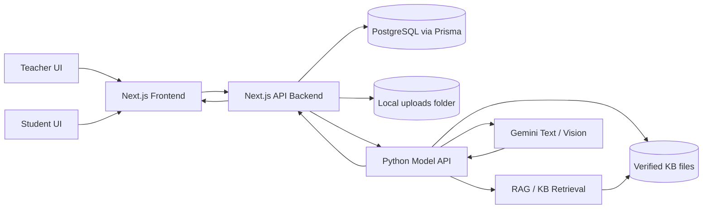
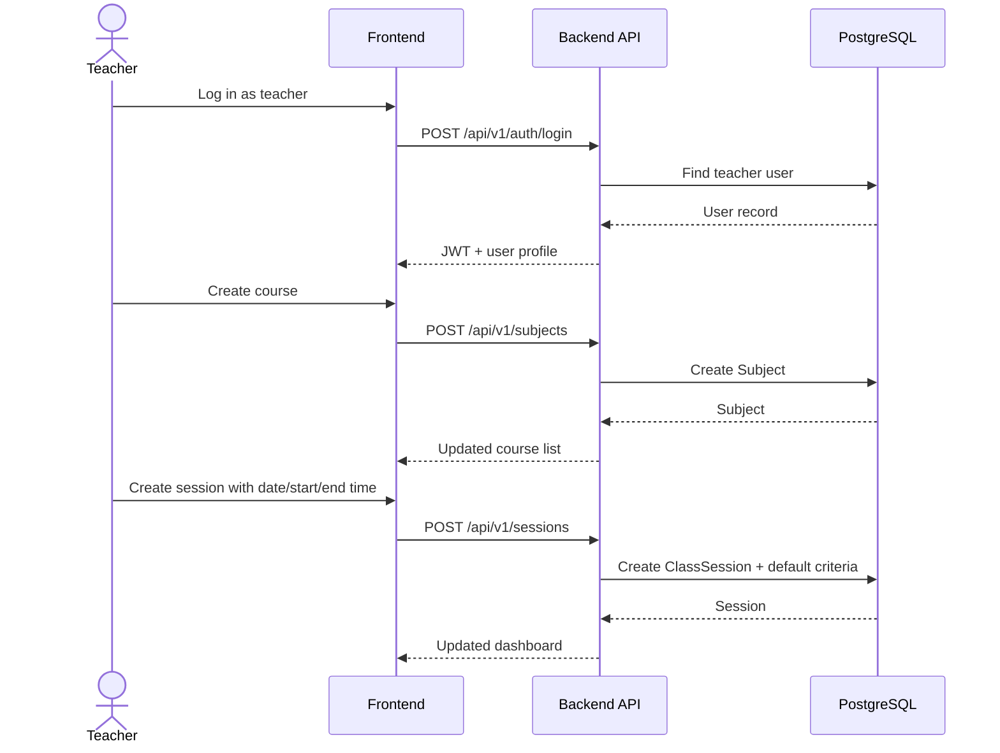
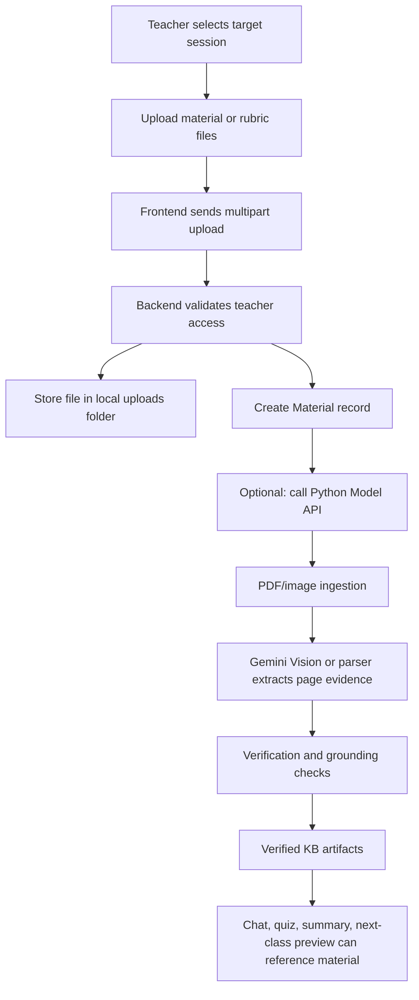
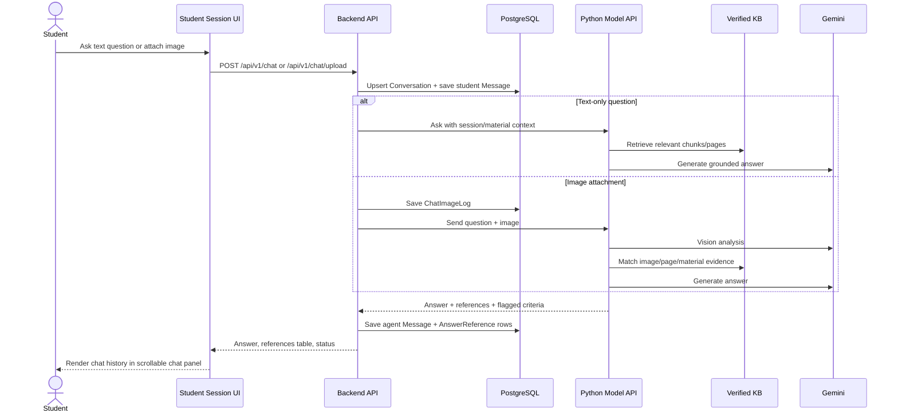
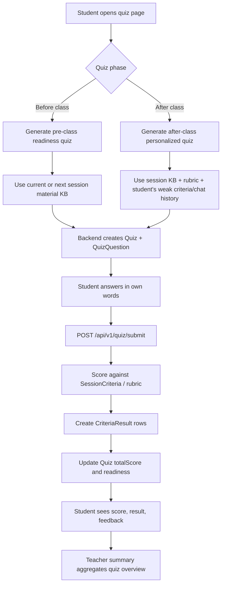
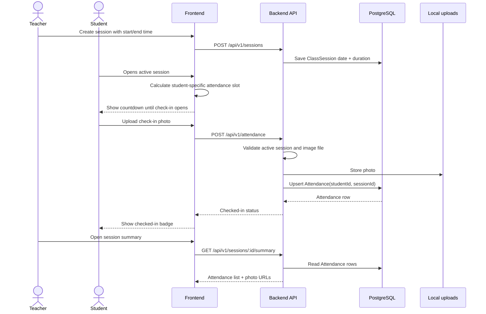
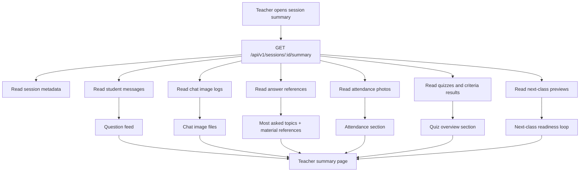
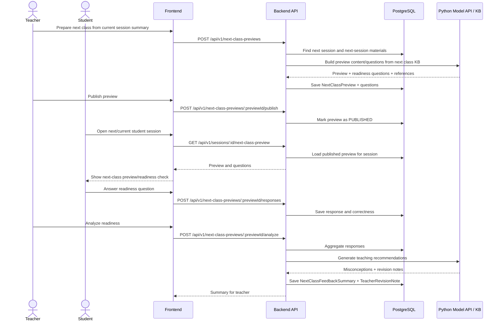
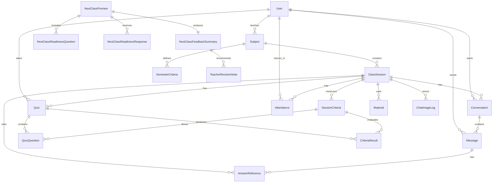
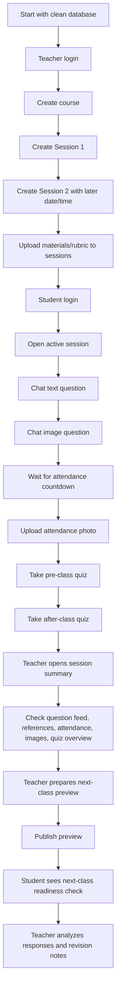

# Learning Companion Project Flow

This document summarizes the main runtime flows in the current Learning Companion prototype.
The diagrams use Mermaid so they can be rendered directly in GitHub, VS Code, Notion, or Mermaid Live Editor.

## 1. System Overview

## 2. Teacher Course And Session Setup

## 3. Material And Rubric Upload To KB

## 4. Student Chat With RAG And References

## 5. Quiz Flow: Pre-class And After-class

## 6. Attendance Check-in Flow

## 7. Teacher Session Summary

## 8. Next-Class Readiness Feedback Loop

## 9. Data Ownership Map

## 10. End-to-End Manual Test Path

