# Learning Companion System Dataflow

This is the high-level dataflow for the whole prototype.

```mermaid
flowchart TB
  subgraph Users
    Teacher[Teacher]
    Student[Student]
  end

  subgraph Frontend["Next.js Frontend"]
    LoginUI[Login]
    TeacherUI[Teacher Dashboard]
    MaterialsUI[Materials and Rubrics]
    SummaryUI[Session Summary]
    StudentDash[Student Dashboard]
    ChatUI[Student Session Chat]
    QuizUI[Pre/Post Quiz]
    AttendanceUI[Attendance Check-in]
  end

  subgraph Backend["Next.js API Backend"]
    AuthAPI[Auth API]
    SubjectAPI[Subject API]
    SessionAPI[Session API]
    MaterialAPI[Material Upload API]
    ChatAPI[Chat API]
    QuizAPI[Quiz API]
    AttendanceAPI[Attendance API]
    SummaryAPI[Session Summary API]
    NextClassAPI[Next-Class Preview API]
    UploadRoute[Upload Download Route]
  end

  subgraph Database["PostgreSQL + Prisma"]
    UsersDB[(User)]
    SubjectDB[(Subject)]
    SessionDB[(ClassSession)]
    CriteriaDB[(SessionCriteria)]
    MaterialDB[(Material)]
    ConversationDB[(Conversation)]
    MessageDB[(Message)]
    QuizDB[(Quiz / QuizQuestion)]
    CriteriaResultDB[(CriteriaResult)]
    AttendanceDB[(Attendance)]
    ChatImageDB[(ChatImageLog)]
    ReferenceDB[(AnswerReference)]
    NextClassDB[(NextClassPreview / Responses / RevisionNotes)]
  end

  subgraph Files["Local File Storage"]
    MaterialFiles[(Uploaded materials)]
    ChatFiles[(Chat attachments)]
    AttendanceFiles[(Attendance photos)]
  end

  subgraph Model["Python Model Service"]
    Ingestion[Material Ingestion]
    KBBuilder[Verified KB Builder]
    Retriever[RAG Retriever]
    AnswerAgent[Answer Agent]
    QuizAgent[Quiz / Scoring Logic]
    VisionAgent[Multimodal Vision Agent]
  end

  subgraph ExternalAI["External AI Provider"]
    Gemini[Gemini Text / Vision]
  end

  Teacher --> LoginUI
  Student --> LoginUI
  LoginUI --> AuthAPI
  AuthAPI --> UsersDB
  AuthAPI --> LoginUI

  Teacher --> TeacherUI
  TeacherUI --> SubjectAPI
  TeacherUI --> SessionAPI
  SubjectAPI --> SubjectDB
  SessionAPI --> SessionDB
  SessionAPI --> CriteriaDB
  SubjectDB --> TeacherUI
  SessionDB --> TeacherUI

  Teacher --> MaterialsUI
  MaterialsUI --> MaterialAPI
  MaterialAPI --> MaterialFiles
  MaterialAPI --> MaterialDB
  MaterialAPI --> Ingestion
  Ingestion --> KBBuilder
  KBBuilder --> Retriever
  Ingestion --> Gemini
  Gemini --> Ingestion

  Student --> StudentDash
  StudentDash --> SessionAPI
  SessionAPI --> SessionDB
  SessionAPI --> AttendanceDB
  SessionAPI --> StudentDash

  Student --> ChatUI
  ChatUI --> ChatAPI
  ChatAPI --> ConversationDB
  ChatAPI --> MessageDB
  ChatAPI --> ChatFiles
  ChatAPI --> ChatImageDB
  ChatAPI --> AnswerAgent
  AnswerAgent --> Retriever
  AnswerAgent --> Gemini
  VisionAgent --> Gemini
  ChatAPI --> ReferenceDB
  ChatAPI --> MessageDB
  ChatAPI --> ChatUI

  Student --> QuizUI
  QuizUI --> QuizAPI
  QuizAPI --> QuizAgent
  QuizAgent --> Retriever
  QuizAgent --> Gemini
  QuizAPI --> QuizDB
  QuizAPI --> CriteriaResultDB
  QuizAPI --> QuizUI

  Student --> AttendanceUI
  AttendanceUI --> AttendanceAPI
  AttendanceAPI --> AttendanceFiles
  AttendanceAPI --> AttendanceDB
  AttendanceAPI --> AttendanceUI

  Teacher --> SummaryUI
  SummaryUI --> SummaryAPI
  SummaryAPI --> SessionDB
  SummaryAPI --> MessageDB
  SummaryAPI --> ReferenceDB
  SummaryAPI --> QuizDB
  SummaryAPI --> CriteriaResultDB
  SummaryAPI --> AttendanceDB
  SummaryAPI --> ChatImageDB
  SummaryAPI --> NextClassDB
  SummaryAPI --> SummaryUI

  SummaryUI --> NextClassAPI
  NextClassAPI --> SessionDB
  NextClassAPI --> MaterialDB
  NextClassAPI --> Retriever
  NextClassAPI --> Gemini
  NextClassAPI --> NextClassDB
  NextClassAPI --> SummaryUI

  StudentDash --> NextClassAPI
  ChatUI --> NextClassAPI
  NextClassAPI --> StudentDash
  NextClassAPI --> ChatUI

  UploadRoute --> MaterialFiles
  UploadRoute --> ChatFiles
  UploadRoute --> AttendanceFiles
```

## Reading The Diagram

- The frontend is the only browser-facing layer.
- The backend owns authentication, authorization, database writes, and file upload/download routes.
- PostgreSQL stores structured learning records: users, courses, sessions, criteria, chat, quiz, attendance, references, and next-class feedback.
- Local storage keeps uploaded PDFs/images/photos during local development.
- The Python model service builds and searches the verified KB, then calls Gemini only when AI generation or vision analysis is needed.
- Teacher summary is an aggregation layer over chat, quiz, attendance, references, images, and next-class feedback.
